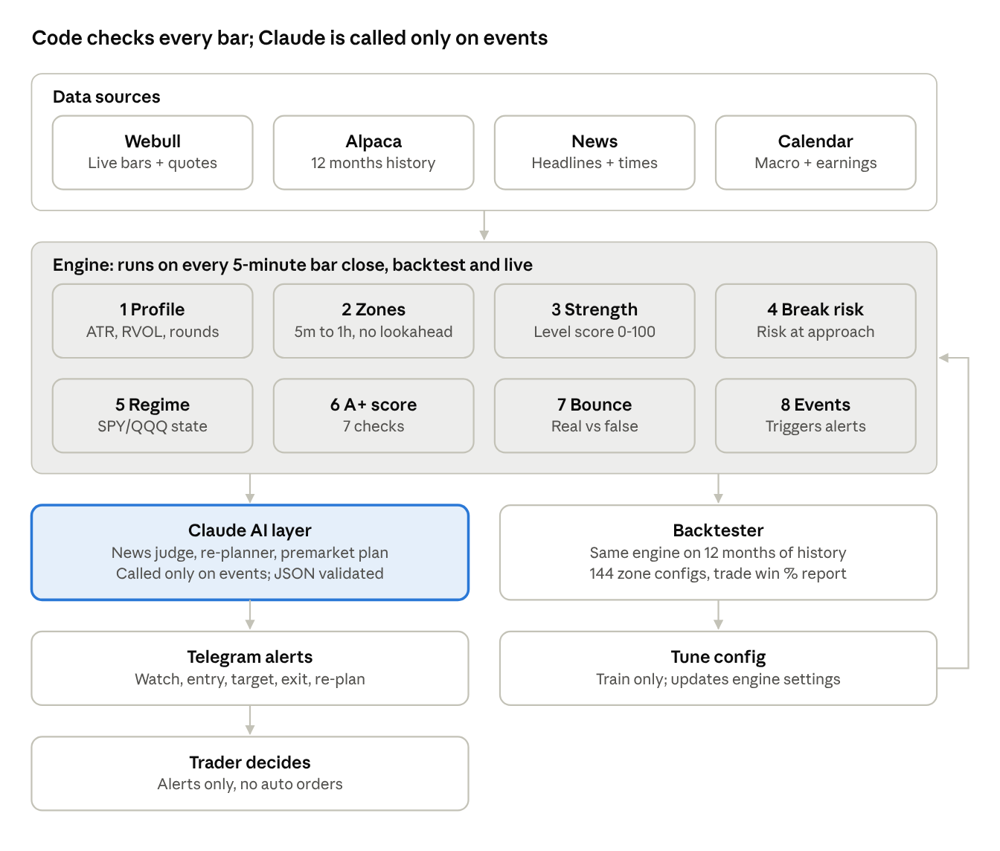
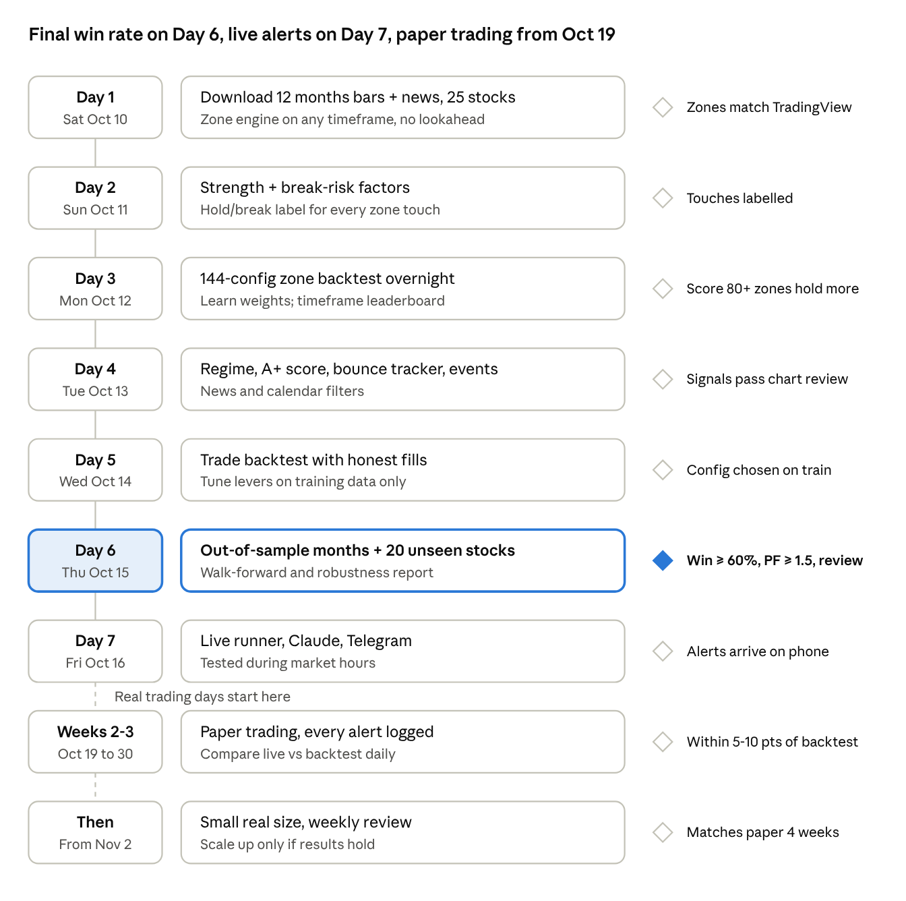

# Day-Trading Agent — Architecture & Build Plan

Oct 9, 2026 · @sushanth

## Overview and goals

Build a day-trading alert agent in 7 days that reaches an **60–65%+ win rate with strong expectancy and profit factor** on out-of-sample backtests, then prove it on real trading days. The system finds strong support/resistance zones, validates real vs false bounces, adapts its bias as the market moves, and sends entry/exit alerts. It never places orders.

| Term          | Definition                                                                                                                                                                             |
|---------------|----------------------------------------------------------------------------------------------------------------------------------------------------------------------------------------|
| Win           | T1 hit before the stop                                                                                                                                                                 |
| Loss          | Stop hit first                                                                                                                                                                         |
| R             | Profit or loss in units of initial risk (entry to stop)                                                                                                                                |
| Expectancy    | win% × avg win (R) − loss% × avg loss (R)                                                                                                                                              |
| Backtest pass | ≥ 60% wins (65% target) on ≥ 200 out-of-sample trades AND expectancy ≥ +0.25R at the worst-case win rate AND profit factor ≥ 1.5 AND max drawdown ≤ 10R AND trader chart review passed |
| Live pass     | Paper win % within 5–10 points of backtest over 2 weeks, no system errors                                                                                                              |

Core principles:

- **Every distance scales per stock** as a multiple of 5-minute ATR — never fixed dollars.

- **No lookahead**: every module uses only data available at that bar's close.

- **Code monitors, Claude judges**: rules run on every bar; Claude is called only on events (news, regime change).

- **One engine for backtest and live**: the same modules run on history and on the live stream.

- **Alerts only**: the trader decides and places orders.

Scope: day trading only (same-day exits). Swing trading is a later phase reusing the same modules with daily/weekly settings.

## System architecture

Four data sources feed eight engine modules that run on every 5-minute bar; their events go to Claude (only when needed) and then to Telegram, while the backtester runs the same engine on history and feeds tuned settings back.

system architecture · data, engine, AI, alerts, backtest

The tinted engine block is the core: identical code in backtest and live, so a backtest result describes exactly what runs on real trading days.

## Data layer

Webull runs the live system; Alpaca supplies backtest history, because Webull's history endpoint returns at most 1,200 recent bars (about 15 trading days of 5-minute bars).

| Source                       | Used for                                            | Notes                                                                                                             |
|------------------------------|-----------------------------------------------------|-------------------------------------------------------------------------------------------------------------------|
| Webull OpenAPI (HTTP)        | Recent bars at startup, daily archive               | Max 1,200 bars per request, no date range. Needs App Key/Secret + market data subscription (403 = not subscribed) |
| Webull OpenAPI (MQTT stream) | Live quotes and ticks → 5m bars                     | Python SDK webull-openapi-python-sdk                                                                              |
| Alpaca historical bars       | 12+ months of 1m–daily bars for backtests           | Free account; date-range queries                                                                                  |
| Alpaca news (Benzinga)       | Historical + live headlines with publish timestamps | Needed so news filters can be backtested                                                                          |
| Economic calendar            | CPI, FOMC, jobs report, Fed speakers                | Stored as a dated table, updated yearly                                                                           |
| Earnings calendar            | Per-stock earnings dates                            | From data provider                                                                                                |
| CSV archive                  | Daily Webull bars saved after close; offline tests  | Builds Webull-native history over time                                                                            |

**Standard bar schema** (every provider returns this): pandas DataFrame, tz-aware index in America/New_York, columns open, high, low, close, volume as floats, sorted, de-duplicated.

**Timeframes**: 1m, 5m, 15m, 30m, 1h, D. Higher timeframes are resampled from 5m when a provider lacks them, using bar-close timestamps so no future data leaks.

**Universe**: build/tune on SPY, QQQ, DELL, SOXL, NVDA; validate on 20 unseen stocks (AMD, TSLA, META, AAPL, MSFT, AMZN, AVGO, MU, PLTR, COIN + 10 more chosen before tuning starts). Market context: SPY, QQQ, SMH, VIXY (VIX index not covered by Webull).

**Alpaca vs Webull alignment check (Day 1, blocks the backtest until it passes)**: on the ~15 days both sources cover, compare 5m bars per stock for the same bar-start timestamp convention, the same regular vs extended session split, unadjusted minute prices on both (request Alpaca raw, SIP feed), closes within 0.05% and volume within 10%. Any mismatch is fixed in the provider before history is used.

## Engine modules

Eight pure-Python modules run in order on every 5-minute bar close; each takes bars plus earlier modules' outputs and returns plain data, so the same code runs in backtest and live.

| \#  | Module     | Input                                | Output                                                                                       | Key rules                                                                                                                                                                                                                                                        |
|-----|------------|--------------------------------------|----------------------------------------------------------------------------------------------|------------------------------------------------------------------------------------------------------------------------------------------------------------------------------------------------------------------------------------------------------------------|
| 1   | profile ✅ | 5m + daily bars                      | StockProfile: daily ATR, 5m ATR, RVOL baseline by time slot, round-number step, spread       | 5m ATR ignores overnight gaps; regular-hours bars only                                                                                                                                                                                                           |
| 2   | zones      | Bars per timeframe                   | Zones: top, bottom, timeframe(s), pivots, created_at                                         | Pivot confirmed only N bars after it forms; zone usable only after confirmation (no lookahead)                                                                                                                                                                   |
| 3   | strength   | Zones + bars + profile               | Level strength 0–100 per zone                                                                | Reaction size, timeframe confluence, other confluence, volume at level, role flip, width, age                                                                                                                                                                    |
| 4   | break_risk | Zone + approach bars + regime + news | Break risk 0–100 at approach                                                                 | Recent tests, approach speed, approach shape, regime, news against level                                                                                                                                                                                         |
| 5   | regime     | SPY/QQQ/SMH bars                     | Bullish / Gap filling / Gap filled / Choppy / Bearish                                        | VWAP, gap vs prior close, 10m Ripster 34/50 cloud, opening range                                                                                                                                                                                                 |
| 6   | aplus      | All above                            | A+ score 0–7                                                                                 | Catalyst, level confluence, clouds 5m+10m agree, 5m confirmation, RVOL ≥ 1.5, ≥ 3R to T1, SPY/QQQ not against                                                                                                                                                    |
| 7   | bounce     | Zone + live bars                     | Stage per zone: Touch → Rejection → Confirmed / Fail                                         | Wick ≥ 50% of candle, close beyond zone by 0.1 ATR; follow-through ≥ 0.5 ATR within 2 bars with a close above the rejection candle's high on volume ≥ average; higher low holds; no entry if price is already \> 0.5 ATR past the zone edge (MAX_ENTRY_DIST_ATR) |
| 8   | events     | All above                            | Event list: bounce stage change, VWAP lost/reclaimed, gap filled, cloud flip, OR break, news | Triggers alerts and Claude re-plans                                                                                                                                                                                                                              |

**Zone score shown on charts**: S1 (85) = w_s × strength − w_b × break risk, both weights in config (ZONE_W_STRENGTH, ZONE_W_BREAK, default 1.0) and learned in Backtest 1. 80–100 strong (trade the bounce), 50–79 medium (wait for full confirmation), under 50 weak (watch for break-and-retest).

**Indicators used across modules**: ATR (Wilder, same as TradingView), VWAP (session-anchored), Ripster EMA clouds (5/12 fast, 34/50 slow on 5m and 10m), RVOL by time of day, opening range (first 15 minutes).

## AI layer (Claude)

Claude is called only when an event fires, never on every bar; it returns strict JSON that code validates before anything reaches the trader.

| Role              | Trigger                                                                    | Input                                                            | Output (JSON)                                                                                                                                                       |
|-------------------|----------------------------------------------------------------------------|------------------------------------------------------------------|---------------------------------------------------------------------------------------------------------------------------------------------------------------------|
| News judge        | New headline for a watched ticker, its sector, or the market               | Headline, publish time, ticker, current price/zones/regime       | relevance (ticker / sector / market / none), direction (bullish / bearish / neutral), impact (low / medium / high), action (no_change / tighten / flip bias / exit) |
| Re-planner        | Regime change, gap fill, VWAP lost/reclaimed, cloud flip, high-impact news | Profile, zones with scores, regime, open position, recent events | no_change, or: bias, next entry zone, stop, T1, T2, invalidation, one-line reason                                                                                   |
| Premarket planner | 8:30 ET daily                                                              | Profiles, zones, premarket high/low, calendar, overnight news    | If/then scenarios per ticker (bullish / gap filling / gap filled / choppy)                                                                                          |

Guardrails:

- Claude never invents prices: entries, stops and targets must be picked from zone/ATR values code passes in; code rejects any price not in that list.

- Responses that fail JSON schema validation are dropped and the rule-based plan stands.

- Timeout 10 s; on timeout the alert goes out without the AI note.

- no_change is the default answer; any other action needs a one-line reason. Every call is logged verbatim to SQLite: full prompt, full response, model, latency, cost and the action taken, so any alert can be replayed and reviewed.

- Model: Claude Sonnet via API; prompts stored as versioned files in ai/prompts/.

## Trade rules

A trade fires only when price is at a scored zone, bias and news agree, and the bounce passes rejection plus follow-through; every distance below is a multiple of that stock's 5-minute ATR.

| Rule            | Value                                                                                                                                                | Config key      |
|-----------------|------------------------------------------------------------------------------------------------------------------------------------------------------|-----------------|
| When            | A+ setups any time incl. premarket; A setups once regime is confirmed; no new entries after 3:45 ET                                                  | ENTRY_CUTOFF    |
| Premarket       | Half size, limit orders only, spread ≤ 0.1 ATR, mental stop                                                                                          | PREMARKET_SIZE  |
| Entry (default) | Confirmed: stage 3 higher high. Early (stage 2 close) tested as an alternative. Skip if entry is \> 0.5 ATR from the zone edge (chasing)             | ENTRY_MODE      |
| Stop            | Rejection wick low − 0.1 ATR (long); mirror for short                                                                                                | STOP_BUFFER_ATR |
| Size            | \$ risk ÷ stop distance                                                                                                                              | RISK_PER_TRADE  |
| T1              | Next opposing zone − 0.1 ATR, or 1R if closer stepping stone; sell 1/3, stop → breakeven                                                             | FRONT_RUN_ATR   |
| T2              | Following zone or round number − 0.1 ATR; sell 1/3, stop → below cloud                                                                               | —               |
| Last third      | Trail: exit on 5m close below the 5/12 cloud or below the last higher low                                                                            | —               |
| Warning sign    | Rejection wick at a level, failed breakout, 3+ stalling candles → sell half, tighten stop                                                            | —               |
| Exit all        | 5m close below 34/50 cloud (long), false-bounce close back in zone, high-impact news against                                                         | —               |
| Skip            | Bias disagrees, inside news window (5 min before to 15 min after macro events), earnings week (or half size), spread too wide, first zone \> 5R away | NEWS_WINDOW     |
| Daily limits    | Stop after 2 losses in a row or max daily \$ loss                                                                                                    | MAX_DAILY_LOSS  |

Round-number spacing: under \$20 → \$0.50 · \$20–100 → \$1 · \$100–300 → \$2.50 · \$300+ → \$5.

## Backtesting and validation

Two backtests run on 12 months of history: first the zones alone (do they hold?), then full trades (do they win?); every decision is made on training data and confirmed on untouched data.

**Data split**

| Set                    | Period / stocks                      | Used for                               |
|------------------------|--------------------------------------|----------------------------------------|
| Train                  | Oct 2025 – Jun 2026, 5 build stocks  | Learning weights, picking configs      |
| Out-of-sample (time)   | Jul – Oct 2026, same 5 stocks        | Confirming results hold later in time  |
| Out-of-sample (stocks) | Full 12 months, 20 unseen stocks     | Confirming results hold on other names |
| Walk-forward           | Rolling 3-month train → 1-month test | Stability month to month               |

**Backtest 1 — zone quality (144 configs)**

- Timeframe combos (8): 5m · 15m · 30m · 1h · 5m+30m · 5m+1h · 15m+1h · 5m+30m+daily context.

- Settings (18): pivot period 5/10/20 × channel width 1/2/3% × min strength 1/2.

- Per touch: record all strength and break-risk factors + outcome (held = moved 0.5 ATR away before breaking by 0.5 ATR).

- Logistic regression learns factor weights and the strength vs break-risk balance on train; check score bands on out-of-sample (80+ should hold far more than under 50).

- Metrics: hold rate, reaction size (ATR), overshoot past zone edge, zones per day, distance from price.

**Backtest 2 — trades (top 10 zone configs)**

- Event-driven, bar by bar, using the live engine modules.

- Fills: a limit fills only if price trades through it by at least one tick; stops fill at stop price minus slippage (0.02% of price); commission and fees per share from config (COMMISSION_PER_SHARE, conservative default \$0.005). Adverse-selection test: a rerun where any entry that price only touched (never traded through) counts as not filled, so the cleanest bounces drop out while losers stay; the config must still pass.

- Metrics: win %, avg win/loss (R), expectancy, profit factor, max drawdown, trades/day, by stock, regime, time of day, news vs quiet days, early vs confirmed entry, premarket vs regular.

- Tuning levers: min zone score, A+ only, confirmed entry, regime agreement, news filter, time-of-day filter, T1 distance, stock list.

**Pass**: ≥ 60% wins (65% target) on ≥ 200 out-of-sample trades; expectancy ≥ +0.25R at the low end of the win-rate 95% range (about ±6.7 pts at 200 trades); profit factor ≥ 1.5; max drawdown ≤ 10R; the adverse-selection rerun still passes; neighbouring settings also pass; and the mandatory trader chart review passes. Win rate alone never counts as success.

## Live runtime and alerts

One async Python process runs from 4:00 to 20:00 ET: it streams Webull data, closes 5-minute bars, runs the engine, and pushes Telegram alerts within about 2 seconds of a bar close.

| Time (ET)          | Job                                                               |
|--------------------|-------------------------------------------------------------------|
| 4:00               | Connect Webull stream; load recent bars; build profiles and zones |
| 8:30               | Premarket planner (Claude) → scenarios message                    |
| Every 5m bar close | Engine modules 1–8 → events → alerts                              |
| On event           | Claude news judge / re-planner if needed → alert update           |
| 15:45              | "No new entries" reminder; open-position summary                  |
| 16:05              | Archive Webull bars to CSV; write daily log                       |
| 20:00              | Shut down                                                         |

**Alert formats** (short, exact prices from the zone and profile):

| Type               | Example                                                                             |
|--------------------|-------------------------------------------------------------------------------------|
| 🟡 Watch           | DELL at S1 570.00–571.00 (85) · watching                                            |
| 🟡 Possible bounce | DELL rejection at S1 · A+ 5/7 · waiting follow-through                              |
| 🟢 Entry           | DELL LONG · entry 572.10 · stop 569.62 · T1 582.57 · T2 585.57 · 44 sh (\$100 risk) |
| 🟢 Target          | DELL T1 hit · sell 1/3 · stop → 572.10                                              |
| 🟡 Warning         | DELL failed breakout 580 · sell half · stop → 575.40                                |
| 🔴 Exit            | DELL false bounce · closed back in zone · exit                                      |
| 🔵 Re-plan         | SPY lost VWAP · bias → wait · cancel new longs                                      |

Reliability: auto-reconnect on stream drop, heartbeat alert if no data for 60 s, all events and alerts logged to SQLite for the after-close review.

## Repo structure and tech stack

One Python 3.12 repo, starting from the Session 1 code (trading_agent_session1.zip); each folder maps to one layer of the architecture.

| Path      | Contents                                                                                                               | Status    |
|-----------|------------------------------------------------------------------------------------------------------------------------|-----------|
| config.py | All settings; distances as ATR multiples                                                                               | ✅        |
| data/     | base.py, webull_provider.py, alpaca_provider.py, csv_provider.py, news.py, calendar.py, stream.py                      | Partly ✅ |
| engine/   | indicators.py ✅, profile.py ✅, zones.py, strength.py, break_risk.py, regime.py, aplus.py, bounce.py, events.py       | Partly ✅ |
| ai/       | client.py, news_judge.py, replanner.py, schemas.py, prompts/\*.md                                                      | —         |
| alerts/   | telegram.py, formatter.py                                                                                              | —         |
| backtest/ | zone_backtest.py, trade_backtest.py, fills.py, metrics.py, split.py, report.py                                         | —         |
| live/     | runner.py (async loop), scheduler.py, store.py (SQLite)                                                                | —         |
| scripts/  | run_profile.py ✅, archive_webull.py ✅, download_history.py, run_zone_backtest.py, run_trade_backtest.py, run_live.py | Partly ✅ |
| tests/    | Unit tests per module + lookahead tests + synthetic data                                                               | Partly ✅ |
| CLAUDE.md | Instructions for Claude Code (see handoff)                                                                             | —         |

| Layer     | Tech                                                                |
|-----------|---------------------------------------------------------------------|
| Language  | Python 3.12, pandas, numpy                                          |
| Modelling | scikit-learn (logistic regression), joblib for parallel config runs |
| Data      | webull-openapi-python-sdk, alpaca-py, Parquet for history cache     |
| AI        | anthropic SDK, pydantic for JSON schemas                            |
| Alerts    | Telegram Bot API (python-telegram-bot)                              |
| Storage   | SQLite (events, alerts, trades), CSV/Parquet (bars)                 |
| Testing   | pytest                                                              |
| Secrets   | .env via python-dotenv (never committed)                            |

## 7-day build plan

The full scope is built and backtested Oct 10–16, with the final out-of-sample win rate on Day 6; paper trading on real market days starts Oct 19. Each diamond is the gate that must pass before the next day starts.

build plan · 7 days + live testing, gate per step

What it takes: about 6–8 hours a day from the trader, the build run in Claude Code, all API keys ready on Day 1, and the machine left on overnight Monday and Thursday for the big backtests.

## Testing guardrails, risks and open items

The biggest risk is a backtest that lies; every guardrail below exists to stop an inflated win rate from reaching live trading.

| Guardrail            | Test                                                                                                                                                                                                                  |
|----------------------|-----------------------------------------------------------------------------------------------------------------------------------------------------------------------------------------------------------------------|
| No lookahead         | For every module: output at bar t is identical whether bars after t exist or not                                                                                                                                      |
| Higher-timeframe lag | A 30m/1h zone appears only after its bar closes and its pivot confirms                                                                                                                                                |
| Honest fills         | Limits fill only if price trades through; T1 at 582.00 with high 581.91 = no fill; commission included; adverse-selection rerun must still pass                                                                       |
| Slippage             | 0.02% of price on every fill                                                                                                                                                                                          |
| Overfitting          | Configs chosen on train only; out-of-sample run once at the end; neighbours of the chosen config must also pass                                                                                                       |
| News timing          | Only headlines published before the bar close are used                                                                                                                                                                |
| Chart match          | Zones within 0.1 ATR of TradingView on 5 manually checked days                                                                                                                                                        |
| Signal match         | Mandatory before declaring success: 50 randomly sampled out-of-sample trades (winners and losers) checked on TradingView by the trader; zones, entry, stop and exit must match the chart or the result does not count |

| Risk                                                        | Mitigation                                                                                                        |
|-------------------------------------------------------------|-------------------------------------------------------------------------------------------------------------------|
| Out-of-sample win rate below 60% or profit factor below 1.5 | Tighten levers (fewer, higher-quality trades); below 55% win or PF below 1.2, rethink the setup before going live |
| High win rate but tiny wins                                 | Pass requires expectancy \> 0 at the worst-case win rate                                                          |
| Webull API approval or data subscription delayed            | Apply on day 0; Alpaca can stand in for live polling temporarily                                                  |
| Webull SDK names/response shape differ from docs            | Provider has a tolerant parser; verify on first run                                                               |
| One-week pace causes bugs                                   | Tests per module, daily chart review, day 7 is the buffer                                                         |
| Live market differs from backtest                           | 2 weeks paper, then small size, before full size                                                                  |

Open items:

- [ ] Webull App Key/Secret + market data subscription active

- [ ] Alpaca account + keys

- [ ] Telegram bot token + chat id

- [ ] Anthropic API key

- [ ] Pick the 10 extra unseen validation stocks before tuning starts

- [ ] Dollar risk per trade and max daily loss

## Claude Code handoff

Unzip the Session 1 code into a git repo, add CLAUDE.md below at the root, export this doc to Markdown as docs/ARCHITECTURE.md, then start each day in Claude Code with that day's prompt.

1.  unzip trading_agent_session1.zip && cd trading_agent && git init && git add . && git commit -m "Session 1"

2.  Export this doc → Markdown → save as docs/ARCHITECTURE.md

3.  Create CLAUDE.md with the contents below

4.  Run claude in the repo; first prompt: *"Read CLAUDE.md and docs/ARCHITECTURE.md. Start Day 1."*

\# CLAUDE.md — Day-Trading Agent  
  
Read docs/ARCHITECTURE.md before any change. It is the source of truth.  
  
\## Rules  
- Python 3.12. Pure functions in engine/; no I/O inside engine modules.  
- Every distance = multiple of 5m ATR from StockProfile. Never hardcode dollars.  
- No lookahead: a value at bar t uses only bars \<= t. Add a lookahead test for every new module.  
- Same engine code for backtest and live. No backtest-only shortcuts.  
- Limit fills only when price trades through. Slippage 0.02% of price. Commission from config. Adverse-selection rerun must pass.  
- Alerts only. Never call any order-placing API.  
- Secrets from .env only. Never print or commit keys.  
- Run \`python -m pytest -q\` after every change; all tests must pass before moving on.  
- Keep config in config.py; no magic numbers in modules.  
- Commit at the end of each working step with a clear message.  
  
\## Build order  
Day 1 data download + zones · Day 2 strength + break risk + labels · Day 3 zone backtest (144 configs) + weights · Day 4 regime, A+, bounce, events · Day 5 trade backtest + tuning (train only) · Day 6 out-of-sample + robustness report (pass: win \>= 60%, PF \>= 1.5, expectancy \>= +0.25R worst case, trader chart review) · Day 7 live runner + Claude + Telegram.  
  
\## Trader preferences  
- Chart levels: short labels (S1, R1), exact prices, few levels, black lines, no HOD/LOD/pivot lines.  
- Reports and alerts: short, tables, exact prices.
